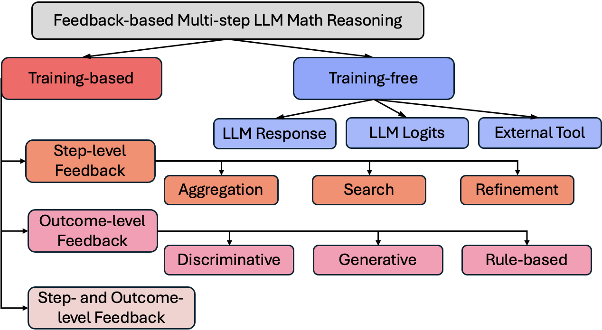
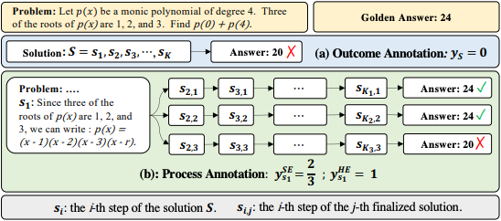
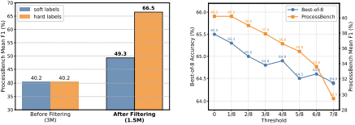
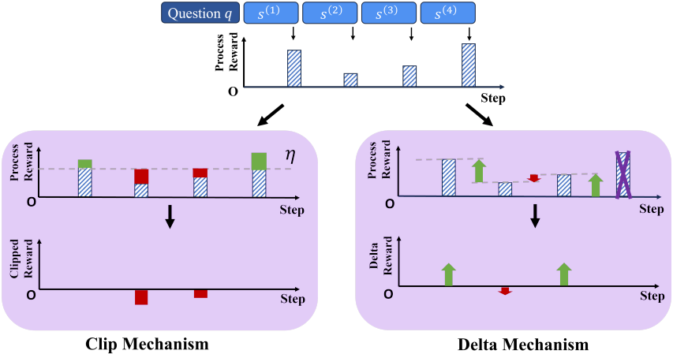

# Feedback-based Multi-step LLM Reasoning in Math

A survey of multi-step reasoning in large language models for math.



Detailed information can be found in our [survey paper](https://arxiv.org/pdf/2502.14333).

```Bibtex
@article{wei2025survey,
  title={A Survey on Feedback-based Multi-step Reasoning for Large Language Models on Mathematics},
  author={Wei, Ting-Ruen and Liu, Haowei and Wu, Xuyang and Fang, Yi},
  journal={arXiv preprint arXiv:2502.14333},
  year={2025}
}
```
## Table of Contents
- [Background in LLM Multi-step Reasoning](#background-in-llm-multi-step-reasoning)
- [Papers](#papers)
  - [Step-level Feedback](#step-level-feedback)
    - [Aggregation](#aggregation)

---

### Background in LLM Multi-step Reasoning
- [Chain-of-Thought Prompting Elicits Reasoning in Large Language Models](https://proceedings.neurips.cc/paper_files/paper/2022/file/9d5609613524ecf4f15af0f7b31abca4-Paper-Conference.pdf)
- [Solving Math Word Problems with Process and Outcome-based Feedback](https://arxiv.org/pdf/2211.14275)
- [Training Verifiers to Solve Math Word Problems](https://arxiv.org/pdf/2110.14168)
- [Let's Verify Step by Step](https://openreview.net/pdf?id=v8L0pN6EOi)
- [Self-Consistency Improves Chain of Thought Reasoning in Language Models](https://arxiv.org/pdf/2203.11171)
- [A Survey of Monte Carlo Tree Search Methods](https://ieeexplore.ieee.org/document/6145622)

---

## Papers

### Training-based

#### Step-level Feedback

- #### **Aggregation**
  
|Title | Venue | Main Image | Paper|
| :--- | :--: | :---: | :---: |
|Making Large Language Models Better Reasoners with Step-Aware Verifier| ACL 2023 |  | [Link](https://aclanthology.org/2023.acl-long.291.pdf)|
|Math-Shepherd: Verify and Reinforce LLMs Step-by-step without Human Annotations| ACL 2024 |  | [Link](https://aclanthology.org/2024.acl-long.510.pdf)|
|Evaluating Mathematical Reasoning Beyond Accuracy| AAAI 2025 |  | [Link](https://arxiv.org/pdf/2404.05692)|
|SELF-EXPLORE: Enhancing Mathematical Reasoning in Language Models with Fine-grained Rewards| EMNLP 2024 |  | [Link](https://aclanthology.org/2024.findings-emnlp.78.pdf)|
|VerifierQ: Enhancing LLM Test Time Compute with Q-Learning-based Verifiers| Arxiv 2024 |  | [Link](https://arxiv.org/pdf/2410.08048)|
|AutoPSV: Automated Process-Supervised Verifier| NeurIPS 2024 |  | [Link](https://proceedings.neurips.cc/paper_files/paper/2024/file/9246aa822579d9b29a140ecdac36ad60-Paper-Conference.pdf)|
|Multi-step Problem Solving Through a Verifier: An Empirical Analysis on Model-induced Process Supervision| EMNLP 2024 |  | [Link](https://aclanthology.org/2024.findings-emnlp.429.pdf)|
|The Reason behind Good or Bad: Towards a Better Mathematical Verifier with Natural Language Feedback| Arxiv 2024 |  | [Link](https://arxiv.org/pdf/2406.14024v1)|
|Advancing Process Verification for Large Language Models via Tree-Based Preference Learning| EMNLP 2024 |  | [Link](https://aclanthology.org/2024.emnlp-main.125.pdf)|
|Improve Mathematical Reasoning in Language Models by Automated Process Supervision| Arxiv 2024 |  | [Link](https://arxiv.org/pdf/2406.06592)|
|Free Process Rewards without Process Labels| Arxiv 2024 |  | [Link](https://arxiv.org/pdf/2412.01981)|
|The Lessons of Developing Process Reward Models in Mathematical Reasoning| Arxiv 2025 |  | [Link](https://arxiv.org/pdf/2501.07301)|
|What Are Step-Level Reward Models Rewarding? Counterintuitive Findings from MCTS-Boosted Mathematical Reasoning| AAAI 2025 |  | [Link](https://arxiv.org/pdf/2412.15904)|
|Process Reward Model with Q-Value Rankings| ICLR 2025 |  | [Link](https://arxiv.org/pdf/2410.11287)|
|Entropy-Regularized Process Reward Model| Arxiv 2024 |  | [Link](https://arxiv.org/pdf/2412.11006)|

- #### **Search**
  
|Title | Venue | Main Image | Paper|
| :--- | :--: | :---: | :---: |
|Deductive Beam Search: Decoding Deducible Rationale for Chain-of-Thought Reasoning| COLM 2024 |  | [Link](https://openreview.net/pdf?id=S1XnUsqwr7)|
|MindStar: Enhancing Math Reasoning in Pre-trained LLMs at Inference Time| Arxiv 2024 |  | [Link](https://arxiv.org/pdf/2405.16265)|
|No Train Still Gain. Unleash Mathematical Reasoning of Large Language Models with Monte Carlo Tree Search Guided by Energy Function| Arxiv 2023 |  | [Link](https://openreview.net/pdf?id=S1XnUsqwr7)|
|Let's Reward Step by Step: Step-Level Reward Model as the Navigators for Reasoning| Arxiv 2023 |  | [Link](https://arxiv.org/pdf/2310.10080)|
|Token-Supervised Value Models for Enhancing Mathematical Problem-Solving Capabilities of Large Language Models| ICLR 2025 |  | [Link](https://openreview.net/pdf?id=6HcnC3pPkp)|
|GRACE: Discriminator-Guided Chain-of-Thought Reasoning| EMNLP 2023 |  | [Link](https://aclanthology.org/2023.findings-emnlp.1022.pdf)|
|Offline Reinforcement Learning for LLM Multi-Step Reasoning| Arxiv 2024 |  | [Link](https://arxiv.org/pdf/2412.16145)|
|Reward-Guided Speculative Decoding for Efficient LLM Reasoning| Arxiv 2025 |  | [Link](https://arxiv.org/pdf/2501.19324)|
|Ensembling Large Language Models with Process Reward-Guided Tree Search for Better Complex Reasoning| Arxiv 2024 |  | [Link](https://arxiv.org/pdf/2412.15797)|
|AlphaMath Almost Zero: Process Supervision without Process| NeurIPS 2024 |  | [Link](https://arxiv.org/pdf/2405.03553)|
|Scaling LLM Test-Time Compute Optimally can be More Effective than Scaling Model Parameters| Arxiv 2024 |  | [Link](https://arxiv.org/pdf/2408.03314)|

- #### **Refinement**
  
|Title | Venue | Main Image | Paper|
| :--- | :--: | :---: | :---: |
|Learning From Mistakes Makes LLM Better Reasoner| Arxiv 2023 |  | [Link](https://arxiv.org/pdf/2310.20689)|
|Learning Planning-based Reasoning via Trajectories Collection and Process Reward Synthesizing| EMNLP 2024 |  | [Link](https://aclanthology.org/2024.emnlp-main.20.pdf)|
|Step-DPO: Step-wise Preference Optimization for Long-chain Reasoning of LLMs| Arxiv 2024 |  | [Link](https://arxiv.org/pdf/2406.18629)|
|Improving Multi-Step Reasoning Abilities of Large Language Models with Direct Advantage Policy Optimization| Arxiv 2024 |  | [Link](https://arxiv.org/pdf/2412.18279)|
|Enhancing Mathematical Reasoning in LLMs by Stepwise Correction| Arxiv 2024 |  | [Link](https://arxiv.org/pdf/2410.12934)|
|$`LM^2`$: A Simple Society of Language Models Solves Complex Reasoning| EMNLP 2024 |  | [Link](https://aclanthology.org/2024.emnlp-main.920.pdf)|
|GLoRe: When, Where, and How to Improve LLM Reasoning via Global and Local Refinements| Arxiv 2024 |  | [Link](https://arxiv.org/pdf/2402.10963)|
|REFINER: Reasoning Feedback on Intermediate Representations| EACL 2024 |  | [Link](https://aclanthology.org/2024.eacl-long.67.pdf)|
|$`ReST-MCTS^*`$: LLM Self-Training via Process Reward Guided Tree Search| NeurIPS 2024 |  | [Link](https://openreview.net/pdf?id=8rcFOqEud5)|
|On Designing Effective RL Reward at Training Time for LLM Reasoning| Arxiv 2024 |  | [Link](https://arxiv.org/pdf/2410.15115)|
|BackMATH: Towards Backward Reasoning for Solving Math Problems Step by Step| COLING 2025 |  | [Link](https://aclanthology.org/2025.coling-industry.40.pdf)|

---

#### Outcome-level Feedback

- #### **Discriminative Outcome Reward Model**
  
|Title | Venue | Main Image | Paper|
| :--- | :--: | :---: | :---: |
|Training Verifiers to Solve Math Word Problems| Arxiv 2021 |  | [Link](https://arxiv.org/pdf/2110.14168) |
|TinyGSM: Achieving > 80% on GSM8k with Small Language Models| Arxiv 2023 |  | [Link](https://arxiv.org/pdf/2312.09241) |
|V-STaR: Training Verifiers for Self-Taught Reasoners| COLM 2024 |  | [Link](https://arxiv.org/pdf/2402.06457) |
|Rationale-Aware Answer Verification by Pairwise Self-Evaluation| EMNLP 2024 |  | [Link](https://aclanthology.org/2024.emnlp-main.905.pdf) |
|OVM, Outcome-supervised Value Models for Planning in Mathematical Reasoning| NAACL 2024 |  | [Link](https://aclanthology.org/2024.findings-naacl.55.pdf) |
|Large Language Monkeys: Scaling Inference Compute with Repeated Sampling| Arxiv 2024 |  | [Link](https://arxiv.org/pdf/2407.21787) |
|Alphazero-like Tree-Search can Guide Large Language Model Decoding and Training| Arxiv 2024 |  | [Link](https://arxiv.org/pdf/2309.17179) |
|GraphReason: Enhancing Reasoning Capabilities of Large Language Models through A Graph-Based Verification Approach| NLRSE 2024 |  | [Link](https://aclanthology.org/2024.nlrse-1.1.pdf) |

- #### **Generative Outcome Reward Model**
  
|Title | Venue | Main Image | Paper|
| :--- | :--: | :---: | :---: |
|Generative Verifiers: Reward Modeling as Next-Token Prediction| NeurIPS 2024 |  | [Link](https://openreview.net/pdf?id=CxHRoTLmPX) |
|Enhancing LLM Reasoning with Reward-guided Tree Search| Arxiv 2024 |  | [Link](https://arxiv.org/pdf/2411.11694) |

- #### **Rule-based**
  
|Title | Venue | Main Image | Paper|
| :--- | :--: | :---: | :---: |
|DeepSeekMath: Pushing the Limits of Mathematical Reasoning in Open Language Models| Arxiv 2024 |  | [Link](https://arxiv.org/pdf/2402.03300) |
|DeepSeek-R1: Incentivizing Reasoning Capability in LLMs via Reinforcement Learning| Arxiv 2025 |  | [Link](https://arxiv.org/pdf/2501.12948) |

#### Step- and Outcome-level Feedback

|Title | Venue | Main Image | Paper|
| :--- | :--: | :---: | :---: |
| Solving Math Word Problems via Cooperative Reasoning induced Language Models | ACL 2023 |  | [Link](https://aclanthology.org/2023.acl-long.245.pdf) |
| Rewarding Progress: Scaling Automated Process Verifiers for LLM Reasoning | ICLR 2025 |  | [Link](https://arxiv.org/pdf/2410.08146)
